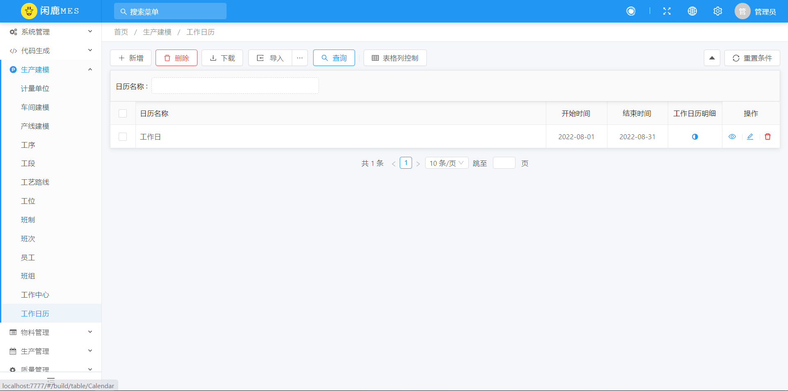
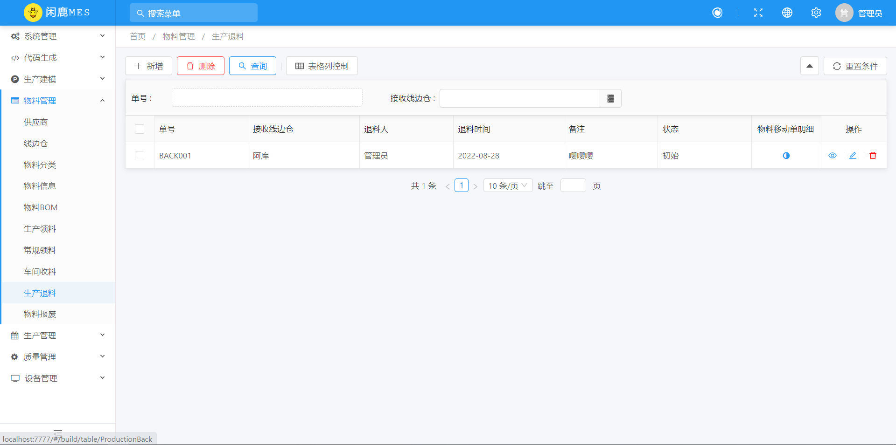
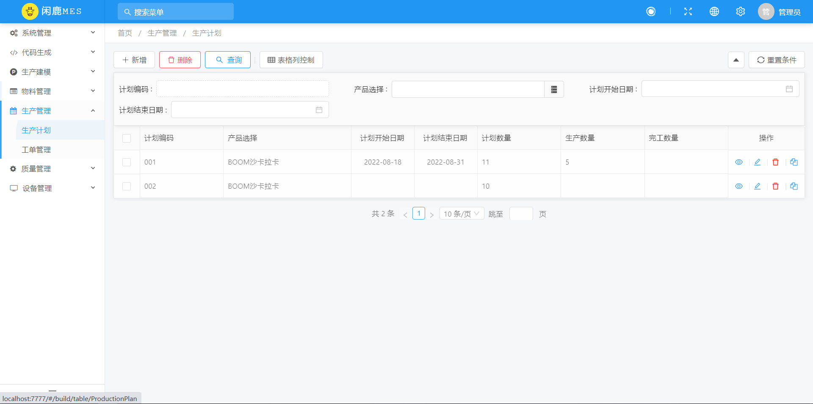

# 闲鹿MES

[TOC]

Spring Boot 实现的 MES 制造执行系统，助力中国制造 2025。


### 一、已实现功能
- 生产建模：计量单位、车间建模、产线建模、工序、工段、工艺路线、工位、班制、班次、员工、班组、工作中心和工作日历；
- 物料管理：供应商、线边仓、物料分类、物料信息、物料BOM、生产领料、常规领料、车间收料、生产退料和物料报废；
- 生产管理：生产计划和生产工单；
- 质量管理：检验项定义和检验清单；
- 设备管理：设备分类和设备台账。


### 二、下一步计划
生产派工、生产接收、在制品查询等。


### 三、免责声明

本系统功能几乎是按照网络上某智能制造解决方案提供商 MES 系统操作手册开发，仅供学习交流，不建议用于商业项目。
如果因为使用本系统造成的一切后果，本人概不负责。

参考文献： http://59.173.241.166:2020/cn/mes/czsc/524.html


### 四、启动教程

修改`application.yml`数据库即可。

```yaml
spring:
  datasource:
    url: jdbc:mysql://你的IP:3306/你的数据库?useUnicode=true&characterEncoding=utf8&zeroDateTimeBehavior=convertToNull&useSSL=true&serverTimezone=GMT%2B8&nullCatalogMeansCurrent=true
    username: root
    password: 密码
```


可选：启用 Redis 缓存会话，在线用户等

```yaml
spring
# cancel comment below
#  redis:
#    host: localhost

erupt:
  # set true
  redisSession: false
```


**如果不想手动创建业务系统菜单，直接执行`sql`目录下的脚本即可。**


页面访问

http://localhost:7777/

账号 / 密码 

erupt / erupt


### 五、系统截图（部分）

#### 5.1 生产建模

计量单位


车间建模


产线建模


工序


工段


工艺路线


工位


班制


班次


员工


班组


工作中心


工作日历




#### 5.2 物料管理

供应商


线边仓


物料分类


物料信息


物料BOM


生产领料


常规领料


车间收料


生产退料




物料报废


#### 5.3 生产管理

生产计划




工单管理


### 六、微信交流群、QQ交流群


微信群过期的话，可以加作者个人微信: **huangluqian12345**（备注 闲鹿MES），拉你进群。

